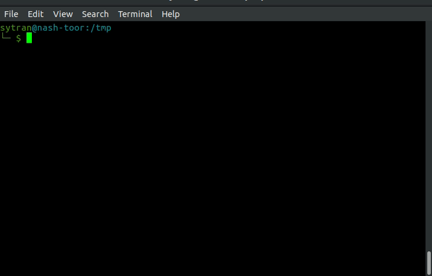
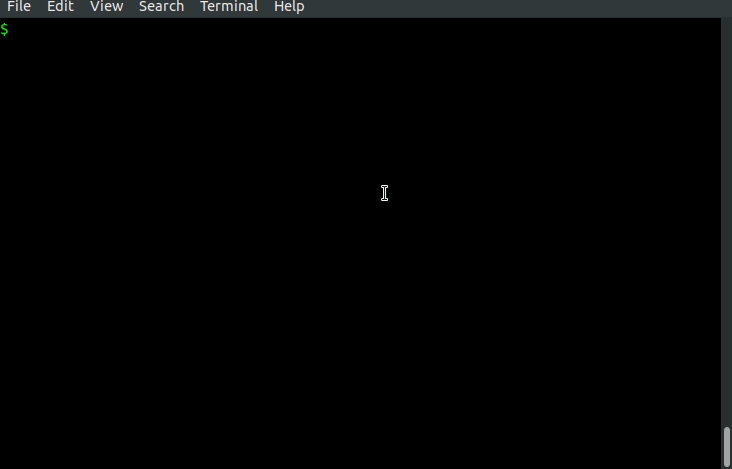
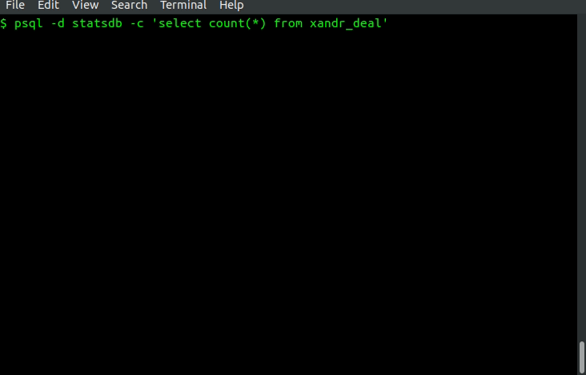

# Tunnel
## Usage


- Create database and insert default data `tunnel init [-f FILE]`
- Add more connection `tunnel add -n NAME -H HOST -p PORT -l LOCAL_PORT -g GATEWAY`
- List connections `tunnel ls [-s {up,down,all}]`
- Connect/Disconnect tunnel ` tunnel <up|down> names [names ...]`

```sh
└─ $ tunnel ls
redshift:5439 ✔️
rds:5438 ❌
neo4j:7474 ❌
scheduler:9073 ❌

└─ $ tunnel up rds
Activate tunnel rds
Activated.

└─ $ tunnel down redshift
Disconnected from redshift

└─ $ tunnel ls -s up
rds:5438 ✔️

└─ $ tunnel ls -s down
redshift:5439 ❌
neo4j:7474 ❌
scheduler:9073 ❌
```

## Require
- python3
- sqlite3

## Install
- Add contain folder to `PATH`
- Auto completion ``echo 'eval "`tunnel complete`"' >> ~/.bashrc``
- Add connections into `config.ini` following format then `tunnel init`.

## Platform

| | Linux | Mac |
|--|--|--|
|Tested| ✔️ | ❌ |

# DB Tools




```shell script
$ schem <table>
    Print schema table

$ readtb <table>
    Dump table data to stdout

$ writetb <table> [psql options]
    Insert data to table from input
```

# OTHERS
```shell script
$ stay-alive <connection_name>
    Keep connection alive
```
